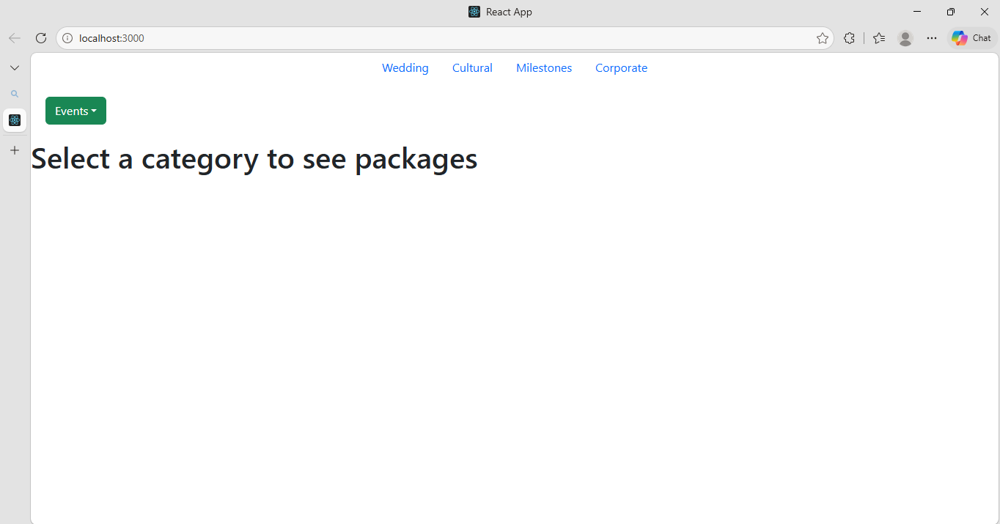
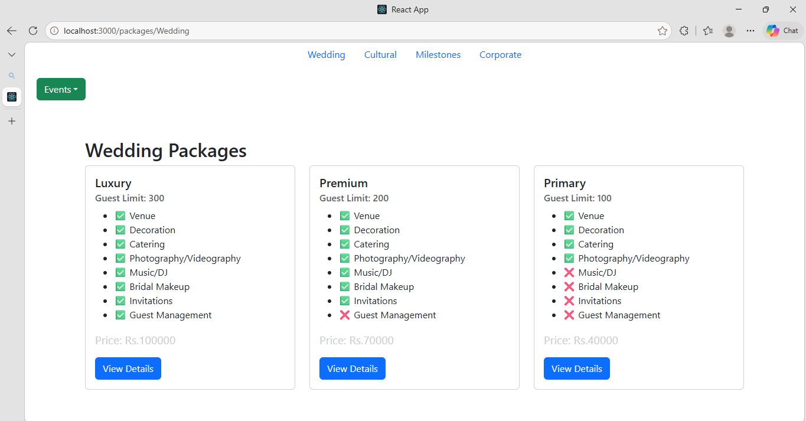
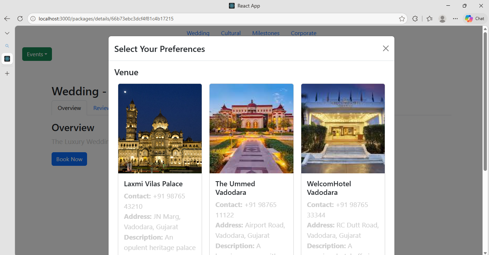
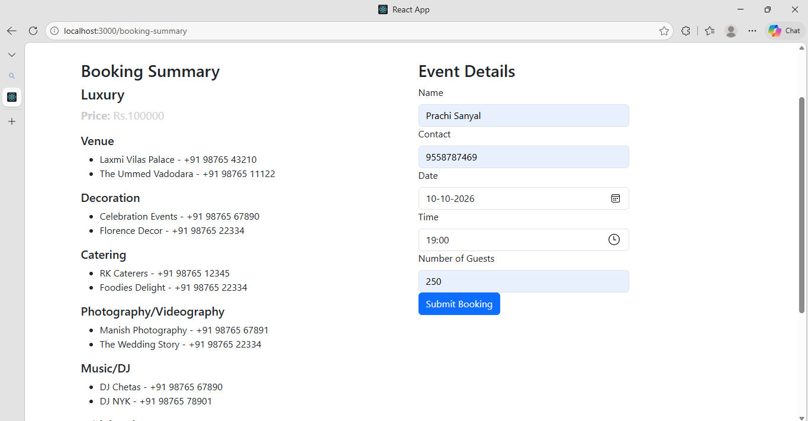
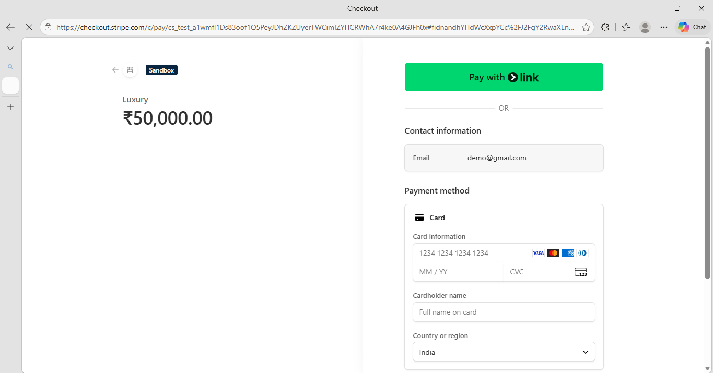
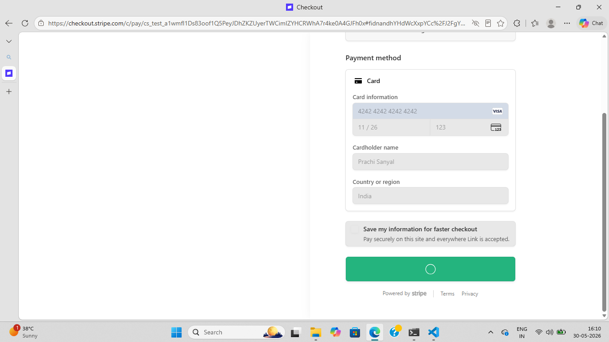
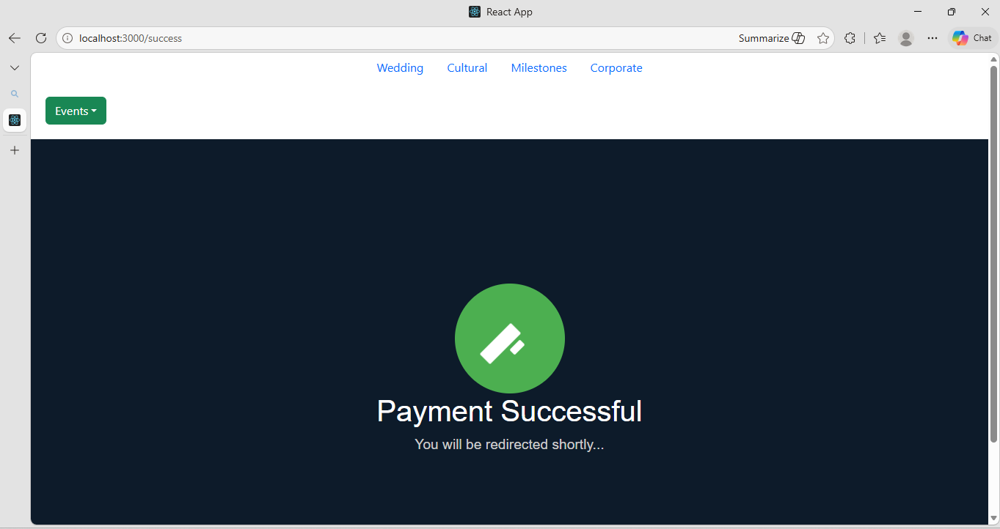

# One Stop Events

A full-stack event management web application developed as a college mini project. The platform allows users to explore event packages, compare services, select vendors, and book events through a streamlined booking process.

## Tech Stack

## My Contributions

* Developed backend APIs using Node.js and Express.js
* Designed and implemented the event booking workflow
* Built chatbot frontend and backend functionality
* Designed the database schema and contributed to MongoDB implementation
* Integrated Stripe payment gateway
* Worked with MongoDB Atlas and Cloudinary services
* Developed frontend screens for package selection and booking process

## Flow of What I Built

* Browse event categories and packages
* Compare package features and services
* View package details and customer reviews
* Select vendor preferences for event services
* Booking summary and event details form
* Secure online payments using Stripe
* Integrated chatbot for user assistance

## Screenshots

### Event Selection

### Package Selection

### Vendor Selection

### Booking Summary

### Payment

## Note

This repository showcases my contributions to a team-based college mini project that was originally developed outside of GitHub collaboration.
